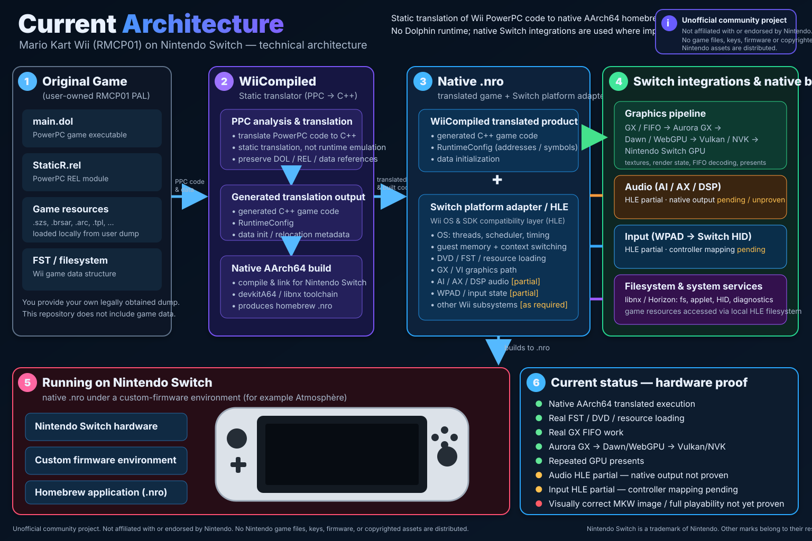

# WiiCompiled-Switch

Experimental Nintendo Switch (Horizon OS / Atmosphère) homebrew porting layer for [WiiCompiled](https://github.com/patchzyy/Wiicompiled).

## Goal

Run a legally-owned Mario Kart Wii dump through the WiiCompiled static-recompilation runtime as a native AArch64 Nintendo Switch homebrew application (`.nro`), without Dolphin at runtime.

## Project progress

**First real RMCP01 FIFO/Aurora render work: ✅ hardware validated**

**First game-facing RMCP01 GPU present: ✅ hardware validated**

**Visually confirmed Mario Kart Wii image: ❌ not yet proven**

The project now executes real WiiCompiled-translated RMCP01 code on Switch,
loads real user-owned boot/StaticR/Home Button resources, produces real GX FIFO
work, and presents frames successfully through Aurora → Dawn/WebGPU →
Vulkan/NVK. The next work is to advance game/UI initialization, verify GX
state and resources on the executed path, and establish recognizable Mario
Kart Wii pixels. Present counters alone do not identify why the observed
screen remains black.

## Current status

The current engineering review and remaining CI/runtime risks are recorded in
[`docs/PORT_AUDIT_2026-10-03.md`](docs/PORT_AUDIT_2026-10-03.md).

The post-`main` fast-track tracked in issue #117 has hardware-crossed the
scheduler/resource/render path through real FST/DVD/SZS/StaticR loading,
TaskThread execution, real FIFO work, `GXCopyDisp`, repeated successful
presents, and multiple Home Button/UI texture-object setup calls.

The latest [accepted Discovery run](docs/HARDWARE_RESULTS_2026-10-03_FOG_Z_COMP_DEPTH_LOD_FRONTIER.md)
returns from the captured Fog call, existing disabled FogRangeAdj,
ZCompLoc(1) and the following pixel setup. It preserves the earlier IA8,
matrix, coordinate, TEV and AlphaCompare progression. The next durable stop is
**GXInitTexObjLOD (`0x80170A4C`)**, object `0x80384170`, dispatch 609384,
at 109.572 seconds. Native init of its 4×4 `GX_TF_Z24X8` depth texture passed;
the LOD structural validator lacks full format 22 and intentionally aborts.
The [depth-LOD candidate](docs/GX_DEPTH_LOD_2026-10-03.md) corrects this format
entry with passing local contracts, all five workflows and private NRO build.
Its first transfer attempt could not connect; console return remains pending. The current on-screen
observation is pending; recognizable game pixels remain unproven.

The [Fog/ZCompLoc candidate](docs/GX_FOG_Z_COMP_2026-10-03.md) passed
host/native contracts, rendered syntax, all five bridge-code workflows and
the private NRO build. All five workflows also passed after the host-test-only
core-dump optimization; its NRO is byte-identical. Nxlink transferred the
validated NRO with exit 0 at **19:20:07 UTC** on 2026-10-03, and fresh reports
now accept both new bridge returns on the executed inputs.

The preceding heartbeat at dispatch 608712 records 1556 guest FIFO writes,
99 successful presents and zero failures. A later post-main snapshot at
609104 records 1558 FIFO writes, including the existing FogRangeAdj command
`E8000156`, and the same 99 presents. These counters do not establish a new
visible frame or separately count native BP emissions. Discovery first hits,
checked caller control flow and coherent later milestones establish returns;
they do not trace every invocation. The watchdog has 98 ACTIVE and four
isolated STALE samples, each followed by renewed progression.

The [bounded coordinate candidate](docs/GX_TEX_COORD_BATCH_2026-10-03.md),
code `91a4a01b8e316f9010e9d31754e279065772f9f3`, passed its local host/workflow
checks and private Rendered Discovery build. Its 73,297,976-byte NRO has
SHA-256 `64ba837720f4e37cbd127c37a0e9bde6dc146ed229a92c8697b9c531a8984d08`.
Nxlink transferred it with exit 0 at 2026-10-02 23:09:38 UTC (01:09:38 on
October 3, Europe/Paris). Fresh reports now accept the eight exact triples;
enabled Scale/Bias branches still have host contracts only. The user confirmed
a black screen for that coordinate run. Its Direct stage-0 arrival remained
unreturned until the later TEV run described below.

The separate audit NRO has SHA-256
`7ecbc8a9fe1efb31697c2ee36d0b0b648a8e87d3fa7dda1fb9d262d6de5b7d09`.
Nxlink transferred it with exit 0 at 2026-10-03 09:25:19 UTC. Fresh reports
accept normal-path non-regression through the same TEV Direct frontier;
the user again confirmed a black screen. SIZE_MAX rejection, Present(false),
teardown exceptions and shutdown recovery were not exercised on this run.
See [the audit record](docs/PORT_AUDIT_2026-10-03.md).

The [bounded TEV scalar batch](docs/GX_TEV_SCALAR_BATCH_2026-10-03.md) passed
local contracts, all five GitHub workflows on integrated code `e76e8f38`, and
its exact private Rendered Discovery build. NRO SHA-256 `cc88a78c...` transferred
with exit 0 at 2026-10-03 11:39:21 UTC. Fresh reports accept all sixteen
iterations on the caller default tuples; alternate arguments retain host
contracts only. The user saw a black screen and an error at the end. The
following KColor guest-pointer boundary stays outside this accepted lot.
The [TEV color/table batch](docs/GX_TEV_COLOR_BATCH_2026-10-03.md)
implements KColor plus the audited adjacent Color and SwapModeTable setters.
All five GitHub workflows, its ten host contracts, rendered syntax gate and
exact private build pass on code `1333b0e2`. NRO `a56be881...` transferred
with exit 0 at 13:43:58 UTC; fresh reports now accept all twelve executed calls.
The next [AlphaCompare candidate](docs/GX_ALPHA_COMPARE_2026-10-03.md) implements
the observed hard stop and preserves the existing native validity flag.
Its eleven host contracts, rendered syntax, all five GitHub workflows and
exact private build pass on code `1a8c092f`. NRO `7032c756...` is ready with
27 checked symbols and unique native/flag providers. Nxlink transferred it
with exit 0 at 17:50:16 UTC; fresh reports accept the observed AlphaCompare
return and identify Fog as the next hard stop.

The method now permits bounded GX batches after auditing the pinned wrapper,
Aurora effects, argument guards and relevant guest-memory mirrors. Every
member still requires its own progression proof; unknown/stateful calls
remain hard stops. Older texture-object, KD and audio results are dated
historical evidence, and different scheduler paths can expose different gates.
A visually correct Mario Kart Wii image is still unproven. The preceding
IA8, coordinate, audit and TEV runs were observed black.

The complete blocker-by-blocker history and current checklist live in
[`ROADMAP.md`](ROADMAP.md). Hardware evidence is recorded in dated files under
[`docs/`](docs/). Static look-ahead is available through
`scripts/forecast-rmcp01-frontier.py`. For whole-product coverage and
first-hit runtime tracing, see
[`docs/RMCP01_DISCOVERY_SCAN.md`](docs/RMCP01_DISCOVERY_SCAN.md) and build:

```sh
MKW_JOBS=4 bash scripts/build-local-rendered-discovery-scan.sh
```

Discovery mode still hard-stops on unknown/stateful boundaries; hardware
evidence remains the authority for runtime patches.

## Important limitations

### Graphics

The normal fast-track GX FIFO bridge remains intentionally a sink, so it stays a reliable **headless control baseline**. The separate rendered fast-track now has hardware-proven real RMCP01 FIFO work **and a successful game-facing `GXCopyDisp → g_surface.Present()`** with `hadWork=1`. Renderer viability and the first GPU present are therefore proven. The remaining graphics question is visual/game-content correctness and the later game/resource path, not whether Aurora/Dawn/NVK can present RMCP01 work on Switch.

### Filesystem / DVD

The project does not fabricate Nintendo game data. The user's own RMCP01 `DATA/sys/fst.bin` is hardware-proven to publish into guest MEM2 at `0x97DC0000`, and the narrow local `DATA/files` DVD bridge is now hardware-proven to service a real boot resource read: `/Boot/Strap/eu/English.szs`, 299,969 bytes. This validates the FST/file mapping on the current boot path; broader DVD semantics remain incomplete and continue to be added only when hardware reaches them.

### IOS / network

The observed boot-time IOS network path is `/dev/net/kd/request`, mode 0.
Hardware has crossed exact KD request sequences for fd 2000 through fd 2003,
including command 2 (Boot probe), command 1 (suspend), command 0x0F
(generated-user-id), and command 3 (resume). Closes for fd 2000 through fd 2003
are hardware-crossed. No generic IOS/network, ioctlv, NCD, IP, SSL, DNS,
socket, or online-play support is claimed.

### Input

Some pinned WPAD/PAD initialization boundaries are mirrored because hardware reached them, but full Joy-Con / Pro Controller / Wii Remote / GameCube input semantics are **not** implemented yet. Input behavior is added only when hardware evidence proves the required boundary and pinned semantics.

## Local fast-track hardware test

After pulling `main`:

```sh
git checkout main
git pull
git submodule update --init --recursive

MKW_JOBS=4 bash scripts/build-local-fast-track.sh
```

For repeat local rebuilds, the incremental helper also exists:

```sh
MKW_JOBS=4 bash scripts/build-local-fast-track-incremental.sh
```

Copy `WiiCompiled-Switch-local-fast-track.nro` to the Switch and launch it through hbmenu in application/title-override mode with full memory.

Keep that headless NRO as the control baseline and build the separate rendered target:

```sh
MKW_JOBS=4 bash scripts/build-local-rendered-fast-track.sh
```

This produces `WiiCompiled-Switch-local-rendered-fast-track.nro`. It contains locally generated game-derived code and must not be uploaded or committed.

The headless control target intentionally has no renderer. Both targets use durable SD diagnostics rather than a text console:

```text
/switch/WiiCompiled-Switch/fast-track-progress.txt
/switch/WiiCompiled-Switch/fast-track-heartbeat.txt
/switch/WiiCompiled-Switch/fast-track-thread-events.txt
/switch/WiiCompiled-Switch/fast-track-heartbeat-history.txt
/switch/WiiCompiled-Switch/fast-track-main-reached.txt
/switch/WiiCompiled-Switch/fast-track-dispatch-blocker.txt
/switch/WiiCompiled-Switch/fast-track-exception.txt
```

For routine sharing, consolidate the generated diagnostics into one compact
archive:

```sh
python3 scripts/package-fast-track-run.py /path/to/copied/WiiCompiled-Switch
```

Use `--full` when scheduler/thread/liveness history is needed. Runtime still
writes the full durable diagnostics on SD while first-frame bring-up remains
active. `fast-track-heartbeat-history.txt` remains the strongest prolonged
stall diagnostic.

## Public CI boundary

Public CI remains Nintendo-data-free. A real WiiCompiled Mario Kart Wii product is generated locally from a user-owned dump before the Switch build and linked into the NRO. Generated game-derived C++/objects/data and game-containing NRO/ELF artifacts are never committed or uploaded by public CI.

The repository currently validates five Nintendo-data-free CI workflows for fast-track changes:

- `lint`;
- `fast-track-startup`;
- `stateful-translated-sequence`;
- `bootstrap-register-prelude`;
- `build-switch`.

For rendered RMCP01 work, these five checks are **necessary but not sufficient**.
The public `build-switch` workflow also compiles every rendered HLE bridge with
`MKW_LOCAL_RENDERED_FAST_TRACK=1` against pinned WiiCompiled/Aurora headers to
catch rendered-only C++ regressions. The private rendered build remains a
required sixth gate because public CI cannot include the user-owned generated
RMCP01 product or the complete private rendered link graph. Build it through
`scripts/build-local-rendered-fast-track.sh` or the documented equivalent
rendered/Discovery target in a validated prepared tree.

A boundary is only called **hardware-crossed** when attributable runtime
evidence places it on the executed path **and** execution durably progresses
beyond it; a hit counter or first-hit record alone is not a PASS. See
[`docs/FAST_TRACK_VALIDATION_POLICY.md`](docs/FAST_TRACK_VALIDATION_POLICY.md).

## Legal / content policy

This repository contains **no Nintendo game code, ROM, disc image, keys, firmware, copyrighted game assets, decrypted content, or generated translated game output**. Users must provide their own legally obtained game dump locally. Do not commit generated game data or extracted assets.

WiiCompiled is GPL-3.0; derivative code in this repository is therefore GPL-3.0 unless a file says otherwise. See [`LEGAL.md`](LEGAL.md).

## Requirements

- A Nintendo Switch capable of running homebrew under Atmosphère
- Homebrew Menu (`hbmenu`)
- devkitPro with `devkitA64` and `libnx`
- GNU Make

Initialize the pinned WiiCompiled source and build the Nintendo-data-free runtime probe:

```sh
git submodule update --init --recursive
make
```

Expected public probe output:

```text
WiiCompiled-Switch.nro
```

The public probe contains no translated Mario Kart Wii product. Game-derived translation is a separate local-only build path.

## Current architecture



<details>
<summary>Text-only architecture summary</summary>

```text
user-owned RMCP01 dump
  -> WiiCompiled static translation (PPC -> generated C++ / RuntimeConfig / data init)
  -> native AArch64 .nro
  -> Switch platform adapter / Wii OS & SDK compatibility HLE
  -> GX/FIFO -> Aurora GX -> Dawn/WebGPU -> Vulkan/NVK -> Switch GPU
  -> libnx/Horizon filesystem + system services
  -> input HLE (partial; controller mapping pending)
  -> audio HLE (partial; native output not hardware-proven)
  -> custom firmware / Nintendo Switch
```

</details>

The diagram reflects the current hardware-proven architecture: translated
AArch64 execution, real resource loading, real GX FIFO work, the
Aurora GX -> Dawn/WebGPU -> Vulkan/NVK graphics chain, and repeated GPU
presents are proven on Switch hardware. Native audio output, complete
controller mapping, a visually correct Mario Kart Wii frame, and full
playability are not yet proven.

## Roadmap and evidence

Start with:

- [Latest accepted TEV result](docs/HARDWARE_RESULTS_2026-10-03_TEV_SCALAR_KCOLOR_FRONTIER.md) — six setters on stages 0..15 return; KColor pointer frontier, black screen and error at exit;
- [TEV scalar batch](docs/GX_TEV_SCALAR_BATCH_2026-10-03.md) — legal SDK domains, host/private-build validation and bounded hardware scope;
- [Earlier audit result](docs/HARDWARE_RESULTS_2026-10-03_AUDIT_GX_TEV_DIRECT_FRONTIER.md) — normal-path non-regression at the preceding Direct frontier;
- [Accepted coordinate batch](docs/GX_TEX_COORD_BATCH_2026-10-03.md) — eight exact triples, host/private-build validation, exact NRO and enabled-branch limits;
- [`ROADMAP.md`](ROADMAP.md) — authoritative current milestone/frontier checklist;
- [`docs/FAST_TRACK_VALIDATION_POLICY.md`](docs/FAST_TRACK_VALIDATION_POLICY.md) — required validation ladder, strict hardware-cross definition, invariant checklist, and private rendered-build gate;
- [`docs/M2_RUNTIME_BOOTSTRAP.md`](docs/M2_RUNTIME_BOOTSTRAP.md) — current runtime/bootstrap architecture and hardware method;
- [`docs/HARDWARE_RESULTS_2026-09-13_MAIN_REACHED.md`](docs/HARDWARE_RESULTS_2026-09-13_MAIN_REACHED.md) — first real `main()` proof;
- [`docs/HARDWARE_RESULTS_2026-09-16_GUEST_FIBER_CONTINUATION.md`](docs/HARDWARE_RESULTS_2026-09-16_GUEST_FIBER_CONTINUATION.md) — HostContext guest continuation proof;
- [`docs/HARDWARE_RESULTS_2026-09-17_OS_WAKEUP_THREAD.md`](docs/HARDWARE_RESULTS_2026-09-17_OS_WAKEUP_THREAD.md) — scheduler frontier that preceded sustained execution;
- [`docs/HARDWARE_RESULTS_2026-09-17_SUSTAINED_LIVENESS.md`](docs/HARDWARE_RESULTS_2026-09-17_SUSTAINED_LIVENESS.md) — first sustained black-screen / AsyncDisplay evidence;
- [`docs/HARDWARE_RESULTS_2026-09-18_ACTIVE_RETRACE_LOOP.md`](docs/HARDWARE_RESULTS_2026-09-18_ACTIVE_RETRACE_LOOP.md) — 126,563-dispatch run proving the black-screen path is an active VI/post-retrace loop;
- [`docs/HARDWARE_RESULTS_2026-09-18_M3_VULKAN_CLEAR_FRAME.md`](docs/HARDWARE_RESULTS_2026-09-18_M3_VULKAN_CLEAR_FRAME.md) — real-Switch changing-color NVK/VI clear-frame presentation proof;
- [`docs/HARDWARE_RESULTS_2026-09-18_M3_VULKAN_TRIANGLE.md`](docs/HARDWARE_RESULTS_2026-09-18_M3_VULKAN_TRIANGLE.md) — real-Switch Vulkan shader/pipeline/rasterisation triangle proof and SD-report follow-up;
- [`docs/HARDWARE_RESULTS_2026-09-18_M3_AURORA_GX.md`](docs/HARDWARE_RESULTS_2026-09-18_M3_AURORA_GX.md) — real-Switch Aurora GX triangle proof, 563-frame active loop, and clean teardown;
- [`docs/HARDWARE_RESULTS_2026-09-18_M3_HLE_FIFO_AURORA.md`](docs/HARDWARE_RESULTS_2026-09-18_M3_HLE_FIFO_AURORA.md) — real-Switch exact pinned `HleFifoWrite` → Aurora GX proof with a 1,435-frame active loop;
- [`docs/HARDWARE_RESULTS_2026-09-19_RMCP01_RESOURCE_THREAD_FRONTIER.md`](docs/HARDWARE_RESULTS_2026-09-19_RMCP01_RESOURCE_THREAD_FRONTIER.md) — FST publication PASS, #185 DVD-read non-reachability, and later priority-6 thread frontier;
- [`docs/HARDWARE_RESULTS_2026-09-19_VI_POLL_CONTEXT_REGRESSION.md`](docs/HARDWARE_RESULTS_2026-09-19_VI_POLL_CONTEXT_REGRESSION.md) — #188 first-fiber crash attribution and register-isolation fix gate;
- [`docs/HARDWARE_RESULTS_2026-09-19_OS_SEND_MESSAGE_FRONTIER.md`](docs/HARDWARE_RESULTS_2026-09-19_OS_SEND_MESSAGE_FRONTIER.md) — #189 hardware PASS, VI starvation fixed, and new `OSSendMessage` blocker;
- [`docs/HARDWARE_RESULTS_2026-09-19_GX_DRAW_DONE_FRONTIER.md`](docs/HARDWARE_RESULTS_2026-09-19_GX_DRAW_DONE_FRONTIER.md) — #190 OSSendMessage PASS and new `GXDrawDone` blocker;
- [`docs/HARDWARE_RESULTS_2026-09-19_TASK_THREAD_FRONTIER.md`](docs/HARDWARE_RESULTS_2026-09-19_TASK_THREAD_FRONTIER.md) — #191 GXDrawDone PASS and resource `TaskThread::run` frontier;
- [`docs/HARDWARE_RESULTS_2026-09-19_GX_SET_PROJECTION_FRONTIER.md`](docs/HARDWARE_RESULTS_2026-09-19_GX_SET_PROJECTION_FRONTIER.md) — first #192 hardware run, TaskThread validation caveat, and new PAL `GXSetProjection` blocker;
- [`docs/HARDWARE_RESULTS_2026-09-19_GX_SET_VIEWPORT_FRONTIER.md`](docs/HARDWARE_RESULTS_2026-09-19_GX_SET_VIEWPORT_FRONTIER.md) — #193 hardware-proves TaskThread + projection and exposes PAL `GXSetViewport`;
- [`docs/HARDWARE_RESULTS_2026-09-19_GX_SET_SCISSOR_FRONTIER.md`](docs/HARDWARE_RESULTS_2026-09-19_GX_SET_SCISSOR_FRONTIER.md) — #194 hardware-proves `GXSetViewport` and exposes PAL `GXSetScissor`;
- [`docs/HARDWARE_RESULTS_2026-09-20_GX_LOAD_POS_MTX_IMM_FRONTIER.md`](docs/HARDWARE_RESULTS_2026-09-20_GX_LOAD_POS_MTX_IMM_FRONTIER.md) — #195 hardware-proves `GXSetScissor` and exposes PAL `GXLoadPosMtxImm`;
- [`docs/HARDWARE_RESULTS_2026-09-20_GX_SET_CURRENT_MTX_FRONTIER.md`](docs/HARDWARE_RESULTS_2026-09-20_GX_SET_CURRENT_MTX_FRONTIER.md) — #196 hardware-proves `GXLoadPosMtxImm`, re-proves `TaskThread::run`, and exposes PAL `GXSetCurrentMtx`;
- [`docs/HARDWARE_RESULTS_2026-09-20_GX_CLEAR_VTX_DESC_FRONTIER.md`](docs/HARDWARE_RESULTS_2026-09-20_GX_CLEAR_VTX_DESC_FRONTIER.md) — #197 hardware-proves `GXSetCurrentMtx` and exposes PAL `GXClearVtxDesc`;
- [`docs/HARDWARE_RESULTS_2026-09-20_GX_SET_VTX_DESC_FRONTIER.md`](docs/HARDWARE_RESULTS_2026-09-20_GX_SET_VTX_DESC_FRONTIER.md) — #198 hardware-proves `GXClearVtxDesc`, re-proves TaskThread, records first post-bootstrap GX FIFO state traffic, and exposes PAL `GXSetVtxDesc`;
- [`docs/HARDWARE_RESULTS_2026-09-20_GX_SET_VTX_ATTR_FMT_FRONTIER.md`](docs/HARDWARE_RESULTS_2026-09-20_GX_SET_VTX_ATTR_FMT_FRONTIER.md) — #199 hardware-proves `GXSetVtxDesc` and exposes PAL `GXSetVtxAttrFmt`;
- [`docs/HARDWARE_RESULTS_2026-09-20_GX_SET_NUM_CHANS_FRONTIER.md`](docs/HARDWARE_RESULTS_2026-09-20_GX_SET_NUM_CHANS_FRONTIER.md) — #200 hardware-proves `GXSetVtxAttrFmt`, explains the deliberate abort/return-to-hbmenu behavior, and exposes PAL `GXSetNumChans`;
- [`docs/HARDWARE_RESULTS_2026-09-20_GX_SET_CHAN_MAT_COLOR_FRONTIER.md`](docs/HARDWARE_RESULTS_2026-09-20_GX_SET_CHAN_MAT_COLOR_FRONTIER.md) — #201 hardware-proves `GXSetNumChans`, re-proves TaskThread, and exposes PAL `GXSetChanMatColor`;
- [`docs/HARDWARE_RESULTS_2026-09-22_GX_FLUSH_CROSSED_TASK_THREAD_JOB_FRONTIER.md`](docs/HARDWARE_RESULTS_2026-09-22_GX_FLUSH_CROSSED_TASK_THREAD_JOB_FRONTIER.md) — hardware-crosses `GXFlush` with 23 successful presents and records the current TaskThread job-dispatch diagnostic frontier;
- [`docs/HARDWARE_RESULTS_2026-09-22_TASK_THREAD_STACK_JOB_FRONTIER.md`](docs/HARDWARE_RESULTS_2026-09-22_TASK_THREAD_STACK_JOB_FRONTIER.md) — proves the received TaskThread “job” aliases the worker stack and moves the frontier to send-side / queue-buffer source attribution;
- [`docs/HARDWARE_RESULTS_2026-09-22_TASK_THREAD_VALID_SEND_RECEIVE_SLOT_FRONTIER.md`](docs/HARDWARE_RESULTS_2026-09-22_TASK_THREAD_VALID_SEND_RECEIVE_SLOT_FRONTIER.md) — proves `TaskThread::request` sends the valid `mJobs[0]` pointer and moves the frontier to the exact `OSReceiveMessage` output-slot clobber phase;
- [`docs/HARDWARE_RESULTS_2026-09-23_VI_POLL_INTERRUPT_MASK_TASK_THREAD_FIX.md`](docs/HARDWARE_RESULTS_2026-09-23_VI_POLL_INTERRUPT_MASK_TASK_THREAD_FIX.md) — phase trace proves the receive slot is correct until the `OSWakeupThread` call boundary; attributes the clobber to Switch pre-call VI retrace delivery while guest interrupts are disabled and defines the minimal interrupt-mask fix;
- [`docs/HARDWARE_RESULTS_2026-09-23_TASK_THREAD_DVD_READ_IDLE_FRONTIER.md`](docs/HARDWARE_RESULTS_2026-09-23_TASK_THREAD_DVD_READ_IDLE_FRONTIER.md) — hardware-validates the interrupt-mask fix, records the first real `/Boot/Strap/eu/English.szs` read-pass, and moves the frontier to `SELECTTHREAD_IDLE_POLL`;
- [`docs/HARDWARE_RESULTS_2026-09-23_ASYNC_DISPLAY_IDLE_VI_WAKE_FRONTIER.md`](docs/HARDWARE_RESULTS_2026-09-23_ASYNC_DISPLAY_IDLE_VI_WAKE_FRONTIER.md) — attributes the idle blocker to `AsyncDisplay::syncTick` and the required wake to VI `PostRetraceCallback`, defining the VI-only scheduler idle candidate;
- [`docs/HARDWARE_RESULTS_2026-09-24_EGG_DECOMP_SZS_FRONTIER.md`](docs/HARDWARE_RESULTS_2026-09-24_EGG_DECOMP_SZS_FRONTIER.md) — hardware-validates AsyncDisplay idle recovery, recovers the real GPU present path, and moves the frontier to pinned `EGG::Decomp::decodeSZS (0x80218C2C)`;
- [`docs/HARDWARE_RESULTS_2026-09-24_SZS_CROSSED_GX_INIT_TEX_OBJ_FRONTIER.md`](docs/HARDWARE_RESULTS_2026-09-24_SZS_CROSSED_GX_INIT_TEX_OBJ_FRONTIER.md) — hardware-validates complete `English.szs` Yaz0 expansion and moves the exact frontier to `GXInitTexObj (0x801707F8)`;
- [`docs/HARDWARE_RESULTS_2026-09-24_GX_INIT_TEX_OBJ_CROSSED_IOS_OPEN_FRONTIER.md`](docs/HARDWARE_RESULTS_2026-09-24_GX_INIT_TEX_OBJ_CROSSED_IOS_OPEN_FRONTIER.md) — hardware-crosses `GXInitTexObj`, preserves one successful GPU present, and moves the exact frontier to `NAND_IOS_Open (0x801938F8)` with path diagnostics only;
- [`docs/HARDWARE_RESULTS_2026-09-24_IOS_OPEN_KD_REQUEST_FRONTIER.md`](docs/HARDWARE_RESULTS_2026-09-24_IOS_OPEN_KD_REQUEST_FRONTIER.md) — identifies the exact IOS path as `/dev/net/kd/request`, mode 0, and defines the minimal pinned device-handle open candidate;
- [`docs/HARDWARE_RESULTS_2026-09-24_KD_OPEN_CROSSED_IOS_IOCTL_CMD2_FRONTIER.md`](docs/HARDWARE_RESULTS_2026-09-24_KD_OPEN_CROSSED_IOS_IOCTL_CMD2_FRONTIER.md) — hardware-crosses the KD open, captures the full fd/cmd/in/out tuple for `IOS_Ioctl (0x80194290)` command 2, and defines the one-shot Boot-phase `-42` reply candidate;
- [`docs/HARDWARE_RESULTS_2026-09-25_KD_CMD2_CROSSED_IOS_CLOSE_FRONTIER.md`](docs/HARDWARE_RESULTS_2026-09-25_KD_CMD2_CROSSED_IOS_CLOSE_FRONTIER.md) — hardware-crosses the first KD command-2 Boot probe and moves the exact frontier to `IOS_Close (0x80193AD8)` with fd 2000;
- [`docs/HARDWARE_RESULTS_2026-09-20_GX_SET_CHAN_CTRL_FRONTIER.md`](docs/HARDWARE_RESULTS_2026-09-20_GX_SET_CHAN_CTRL_FRONTIER.md) — merged #203 hardware-proves `GXSetChanMatColor`, preserves the scheduler/GX chain, and exposes PAL `GXSetChanCtrl`;
- [`docs/HARDWARE_RESULTS_2026-09-21_GX_SET_NUM_TEX_GENS_FRONTIER.md`](docs/HARDWARE_RESULTS_2026-09-21_GX_SET_NUM_TEX_GENS_FRONTIER.md) — real Switch progresses beyond `GXSetChanCtrl` and exposes PAL `GXSetNumTexGens`;
- [`docs/HARDWARE_RESULTS_2026-09-21_GX_SET_NUM_IND_STAGES_FRONTIER.md`](docs/HARDWARE_RESULTS_2026-09-21_GX_SET_NUM_IND_STAGES_FRONTIER.md) — real Switch progresses beyond `GXSetNumTexGens` and exposes PAL `GXSetNumIndStages`;
- [`docs/HARDWARE_RESULTS_2026-09-21_GX_SET_NUM_TEV_STAGES_FRONTIER.md`](docs/HARDWARE_RESULTS_2026-09-21_GX_SET_NUM_TEV_STAGES_FRONTIER.md) — real Switch progresses beyond `GXSetNumIndStages`, advances FIFO state traffic, and exposes PAL `GXSetNumTevStages`;
- [`docs/HARDWARE_RESULTS_2026-09-21_GX_SET_TEV_OP_FRONTIER.md`](docs/HARDWARE_RESULTS_2026-09-21_GX_SET_TEV_OP_FRONTIER.md) — real Switch progresses beyond `GXSetNumTevStages` and exposes PAL `GXSetTevOp`;
- [`docs/HARDWARE_RESULTS_2026-09-21_GX_SET_TEV_ORDER_FRONTIER.md`](docs/HARDWARE_RESULTS_2026-09-21_GX_SET_TEV_ORDER_FRONTIER.md) — real Switch progresses beyond `GXSetTevOp` and exposes PAL `GXSetTevOrder`;
- [`docs/HARDWARE_RESULTS_2026-09-21_GX_SET_BLEND_MODE_FRONTIER.md`](docs/HARDWARE_RESULTS_2026-09-21_GX_SET_BLEND_MODE_FRONTIER.md) — real Switch progresses beyond `GXSetTevOrder` and exposes PAL `GXSetBlendMode`;
- [`docs/HARDWARE_RESULTS_2026-09-21_GX_SET_COLOR_UPDATE_FRONTIER.md`](docs/HARDWARE_RESULTS_2026-09-21_GX_SET_COLOR_UPDATE_FRONTIER.md) — real Switch progresses beyond `GXSetBlendMode` and exposes PAL `GXSetColorUpdate`;
- [`docs/M3_RMCP01_RENDERED_FAST_TRACK.md`](docs/M3_RMCP01_RENDERED_FAST_TRACK.md) — first local Mario Kart graphics-enabled fast-track.

Older dated `HARDWARE_RESULTS_*` files are historical snapshots. Their “next blocker” wording intentionally reflects what was known on that date and is not rewritten retroactively.

## Upstream

The audited WiiCompiled revision is pinned to:

```text
a135beb201042b20f390c6695ca6b26768820fb4
```

CI enforces the pin. New hardware blockers are mapped against that exact revision before any HLE behavior is added.
