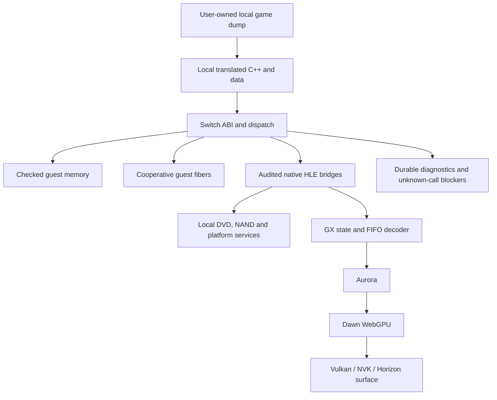

# Switch port architecture

## Implemented boundary

The port reuses WiiCompiled's static PowerPC translation and implements a
Horizon/libnx host layer. It does not rewrite the game or run Dolphin at runtime.
The runtime/Aurora source is pinned to
`a135beb201042b20f390c6695ca6b26768820fb4`; the rendered backend uses the
documented Dawn and Mesa pins. Game-derived translation and assets remain local.

The public Makefile builds Nintendo-data-free probes and synthetic execution
seams. The separate `local-rendered-fast-track/CMakeLists.txt` links the local
translated product with Aurora/Dawn/NVK. The headless fast-track deliberately
retains its FIFO sink as a control baseline. Discovery adds first-hit tracing;
it still aborts at unsupported calls or unproven bridge arguments.

## Memory and ABI

`source/horizon_guest_flat.cpp` reserves a runtime-selected 4 GiB address-space
token and allocates backing from hbloader's existing heap. MEM1/MEM2 aliases
share their backing sections. The reserved guest window is not directly mapped:
`GuestFlat::RequiresCheckedAccess()` stays true, and translated accesses use
the checked Switch Memory path. Deferred protection/executable-range hooks are
explicit no-ops under that policy; fault counters do not measure a desktop
page-fault implementation.

`source/memory_switch_slice.cpp` resolves a complete requested range before
forming a host pointer. GetPointer/Contains reject unavailable, zero-length or
overflowing ranges. Read/Write operations preserve guest big-endian order and
throw AccessViolation for unavailable backing. This is a correctness-first
implementation; linear region lookup remains a potential profiling target.

`include/abi_bridge.h` prefers known native overrides, then generated direct
translated traits. It preserves the pinned nonvolatile floating-point contract.
Indirect calls use the generated immutable dispatch table plus explicitly
ported native overrides. Unknown direct/indirect targets produce durable
diagnostics and terminate; adding a generic success fallback would invalidate
the bring-up evidence.

## Scheduling and platform services

Guest scheduling runs cooperatively on one host thread. Each guest fiber owns
a native stack and saved CpuContext; the handwritten AArch64 context switch
preserves platform state and callee-saved registers. Guest current/running
identities are checked when a suspended caller resumes. VI service points poll
due retraces while respecting the ported interrupt state, so callbacks can add
dispatches and change the diagnostic stage before the original call proceeds.

DVD/FST/SZS, NAND, IOS/KD, input and audio bridges implement bounded paths
attributed to pinned WiiCompiled and real hardware evidence. Their availability
is not a claim of complete Wii filesystem, controller, audio or online support.
Many guards still describe exact observed PAL RMCP01 states. Other game
profiles and arbitrary scheduler/resource states are outside this validation.

## Graphics and evidence

The rendered fast-track connects guest GX FIFO operations to the pinned
decoder and Aurora, then presents through Dawn/NVK. Native GX setters preserve
Aurora state/cache semantics; guest bookkeeping is mirrored only where the
pinned wrapper requires it. Frame activation and presentation are explicit
contracts, not operations to add to every new setter by analogy.

Hardware has established real FIFO work and repeated successful presents.
The latest accepted TEV run preserves ten type-0 texture-matrix loads and
all eight exact Gen2/disabled-Scale/disabled-Bias triples, then returns from
six scalar setters across stages 0..15 on caller default tuples. That preceding scalar run
stopped at KColor ID 0, guest pointer `0x80398FCC`, dispatch 605056.
Enabled Scale/Bias and alternate TEV inputs retain host contracts only.
The user reported black output and an error at exit. The later color/table run crosses that
pointer boundary as documented below. SIZE_MAX rejection, Present(false), teardown exceptions
and shutdown recovery were not exercised on hardware.
The [TEV color/table batch](GX_TEV_COLOR_BATCH_2026-10-03.md) passed all five
GitHub workflows and its exact private build (code `1333b0e2`, NRO `a56be881...`).
Its [fresh console result](HARDWARE_RESULTS_2026-10-03_TEV_COLOR_ALPHA_COMPARE_FRONTIER.md)
now establishes all twelve calls returned, with AlphaCompare `0x80172088`
as that run's arrival boundary. The separate
[AlphaCompare candidate](GX_ALPHA_COMPARE_2026-10-03.md) preserves the pinned
native forwarding and existing host validity flag. Its local contracts, all
five exact-code GitHub workflows and private Rendered Discovery build pass;
its subsequent [console run](HARDWARE_RESULTS_2026-10-03_ALPHA_COMPARE_FOG_FRONTIER.md)
accepts AlphaCompare returned on (7,0,0,7,0), through existing ZMode to Fog.
Fog type 0, four f64 parameters and readable RGBA 255,255,255,255 are captured.
That preceding run stopped before Fog returned; the user confirmed black output
and an error. The [later Fog/ZCompLoc result](HARDWARE_RESULTS_2026-10-03_FOG_Z_COMP_DEPTH_LOD_FRONTIER.md)
now accepts both new bridge returns and the existing pixel setup. Native init
of a 4×4 depth texture passed; GXInitTexObjLOD rejects its valid format 22
because the structural layout table lacks it in that preceding candidate.
The subsequent [depth-LOD hardware result](HARDWARE_RESULTS_2026-10-03_DEPTH_LOD_DISPLAY_LIST_FRONTIER.md)
accepts the corrected LOD return and identifies GXBeginDisplayList as the new
DIRECT boundary. The user confirms black output followed by an error;
recognizable game pixels remain unproven.
See
[`HARDWARE_RESULTS_2026-10-03_TEV_SCALAR_KCOLOR_FRONTIER.md`](HARDWARE_RESULTS_2026-10-03_TEV_SCALAR_KCOLOR_FRONTIER.md),
[`HARDWARE_RESULTS_2026-10-03_AUDIT_GX_TEV_DIRECT_FRONTIER.md`](HARDWARE_RESULTS_2026-10-03_AUDIT_GX_TEV_DIRECT_FRONTIER.md),
[`HARDWARE_RESULTS_2026-10-03_DISCOVERY_GX_TEV_DIRECT_FRONTIER.md`](HARDWARE_RESULTS_2026-10-03_DISCOVERY_GX_TEV_DIRECT_FRONTIER.md),
[`FAST_TRACK_VALIDATION_POLICY.md`](FAST_TRACK_VALIDATION_POLICY.md) and
[`GX_TEX_COORD_BATCH_2026-10-03.md`](GX_TEX_COORD_BATCH_2026-10-03.md).

Presentation counters alone do not establish recognizable game pixels.
Snapshots can precede a newly ported bridge, native Aurora writes can bypass
the instrumented guest FIFO counter, and Discovery records first occurrences
rather than every iteration. Acceptance therefore combines fresh reports,
caller/control flow, coherent context and a later durable milestone.

## Method and remaining engineering work

The chosen bring-up method is appropriate for exposing exact runtime gaps:
attribute the observed frontier, preserve its pinned contract, execute narrow
synthetic tests, compile/link the real rendered candidate, then retest on Switch.
Audited bounded GX families may be batched to reduce rebuilds and console round
trips. Stateful memory, scheduling, callback, DVD and resource changes still
need their own hardware-defined boundaries. Static forecasts prepare the next
review; they cannot establish a hardware return.

The architecture is a working bring-up layer, not a completed compatibility
runtime. The following work remains:

- generalize exact-state guards only after their semantics and legal domains
  have evidence and tests; avoid an ever-growing list of descriptor exceptions;
- broaden executable scheduler/ABI/resource contracts: synthetic NRO symbol
  retention and syntax checks do not execute the console code;
- audit the private rendered link's broad `--allow-multiple-definition` policy
  and replace it with explicit ownership where possible;
- move repeated build preparation toward stable, content-preserving inputs,
  and validate a pinned CI toolchain image before claiming reproducibility;
- profile translated dispatch, checked memory, diagnostics and GPU work once
  a representative game scene runs. Native Horizon execution does not itself
  establish playable performance.

These limits identify the evidence needed before making broader compatibility
or performance claims.

## Earlier console result — TEV colors crossed (2026-10-03)

The [fresh color/table hardware result](HARDWARE_RESULTS_2026-10-03_TEV_COLOR_ALPHA_COMPARE_FRONTIER.md)
supersedes the earlier pending color/table status. All twelve executed calls
returned through the coherent later caller; AlphaCompare `0x80172088`,
(7,0,0,7,0), is the new DIRECT hard stop. Black output and a crash persist.
Actual RGBA bytes and recognizable game pixels remain unproven. The elapsed
time includes an unexplained watchdog sampling gap, so it is not a performance
measurement. Prior dated results above retain their original scope.

## Earlier console result — AlphaCompare crossed (2026-10-03)

The [fresh AlphaCompare hardware result](HARDWARE_RESULTS_2026-10-03_ALPHA_COMPARE_FOG_FRONTIER.md)
establishes its observed tuple returned. Fog `0x801722CC` is the new DIRECT
hard stop at dispatch 603961 / 99.156 seconds, with actual float parameter bits
and readable color captured. All 96 watchdog samples are ACTIVE. Preceding
present counters do not prove visible pixels. The user confirms a black screen
followed by an error; the exact on-screen wording is unavailable. Earlier dated
sections retain their original scope.

## Earlier console result — Fog/ZCompLoc crossed (2026-10-03)

The [fresh hardware result](HARDWARE_RESULTS_2026-10-03_FOG_Z_COMP_DEPTH_LOD_FRONTIER.md)
establishes the admitted Fog call, ZCompLoc(1) and existing pixel setup returned.
The next stop is GXInitTexObjLOD at `0x80170A4C`, dispatch 609384 / 109.572
seconds. Native init passed for the 4×4 `GX_TF_Z24X8` object; the LOD layout
validator lacks full format 22. Its forwarding and later drawing remain
unproven. The later snapshot records 1558 guest FIFO writes and the same 99
successful presents; those counters do not establish a visible frame. Current
screen observation is pending. Earlier dated sections retain their scope.

## Latest console result — depth LOD crossed (2026-10-03)

The [fresh hardware result](HARDWARE_RESULTS_2026-10-03_DEPTH_LOD_DISPLAY_LIST_FRONTIER.md)
establishes LOD returned on the observed depth object with `lod-pass` and guest
word0 `0x105`, then reaches GXBeginDisplayList `0x80172E00`: buffer
`0x80394F00`, capacity 16 KiB, dispatch 609010 / 108.440 seconds. Begin has
not returned; recording/replay require coordinated FIFO/context/buffer work.
The user confirms black output and an error. The snapshot before the texture
constructor retains 99 successful presents, without proof of visible pixels.
Earlier dated records retain their scope.
